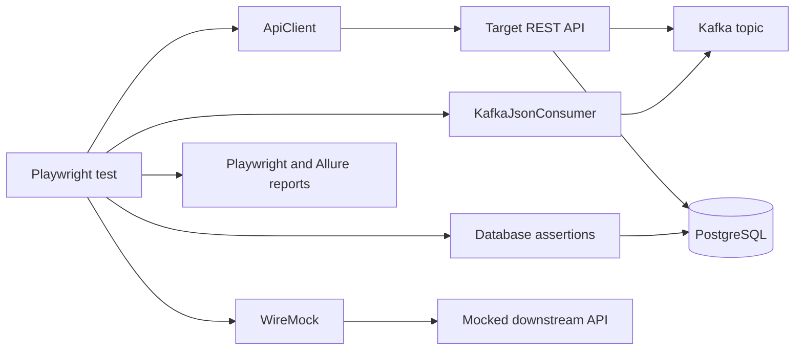

# Architecture

## Purpose

This framework validates REST APIs and their asynchronous side effects. Reusable framework code belongs in `app/src`; executable scenarios and test-only support belong in `tests/src`.

## Component boundaries

## Ownership

| Area                           | Location                           | Responsibility                                           |
| ------------------------------ | ---------------------------------- | -------------------------------------------------------- |
| Runtime configuration          | `app/src/config`                   | Load and validate environment-specific values.           |
| API clients                    | `app/src/clients/api`              | Perform HTTP requests without embedding test assertions. |
| Database clients and utilities | `app/src/clients/db`, `app/src/db` | Connect, query, transact, and clean up.                  |
| Kafka implementation           | `app/src/kafka`                    | Produce and consume JSON messages.                       |
| Tests and assertions           | `tests/src`                        | Describe business scenarios and assert outcomes.         |
| Local services                 | `docker-compose.yml`, `docker`     | Run Kafka, PostgreSQL, and WireMock locally.             |
| Generated diagnostics          | `artifacts`                        | Hold reports and execution output; never commit them.    |

## API to Kafka to PostgreSQL flow

1. A test creates isolated data and a correlation ID.
2. The test starts a Kafka consumer using a unique consumer group and matching correlation ID.
3. The test calls the target API through `ApiClient`.
4. The consumer receives and validates the matching event.
5. Database assertions poll for the expected persisted state.
6. Test cleanup removes data created by the run, even after a failure.
7. The test report records relevant HTTP, Kafka, and database diagnostics.

The first Phase 1 REST test is deliberately self-hosted so that the baseline suite runs without Docker. Real API, Kafka, and database integration starts with the later E2E phase.

## Runtime environments

| Environment | Purpose | Configuration source | Service security |
| --- | --- | --- |
| `local` | Developer feedback and framework development | `.env` copied from `.env.example` | Local Docker credentials and plaintext Kafka. |
| `dev` | Early shared integration validation | CI/environment variables | Environment-provided TLS/SASL and database credentials. |
| `stage` | Release-candidate validation | Protected CI/environment variables | Environment-provided TLS/SASL and database credentials. |

No environment-specific URLs, topic names, credentials, or secrets belong in source files.

## Local service topology

- One KRaft Kafka broker, accessible at `localhost:9092`.
- One PostgreSQL instance, accessible at `localhost:5432`.
- One WireMock instance, accessible at `localhost:8080`.
- Schema Registry is deferred until a real event contract requires Avro or Protobuf.

`npm run services:wait` verifies Kafka administrative access, a PostgreSQL query, and the WireMock admin endpoint before integration tests execute.
